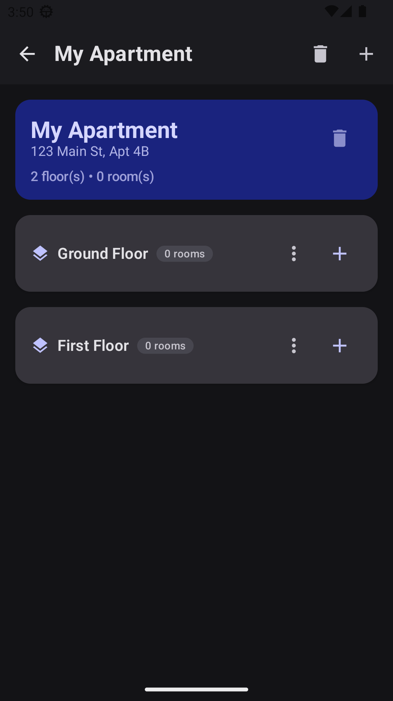
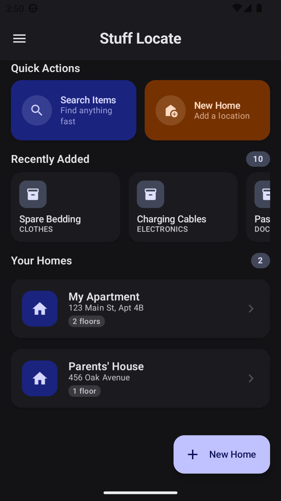
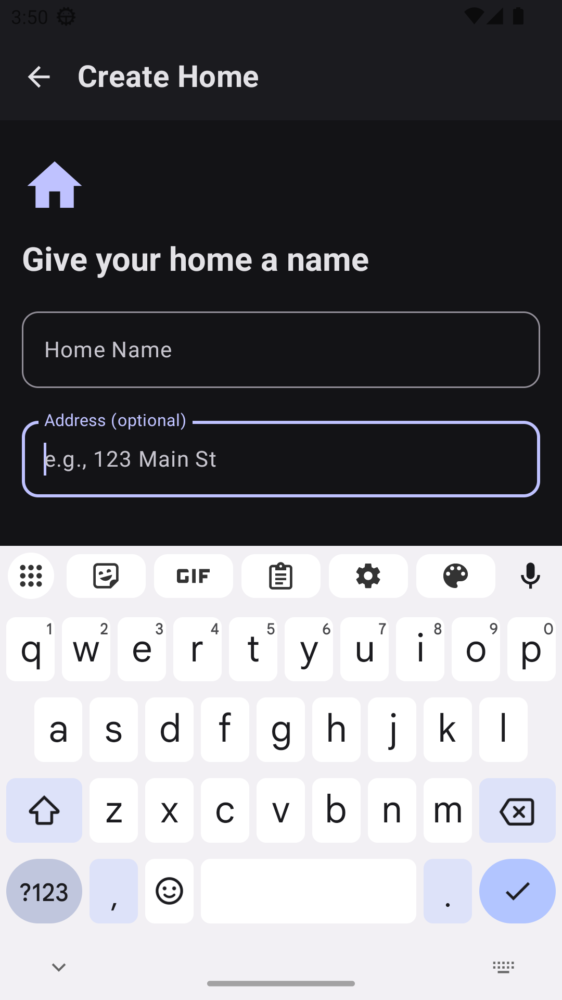
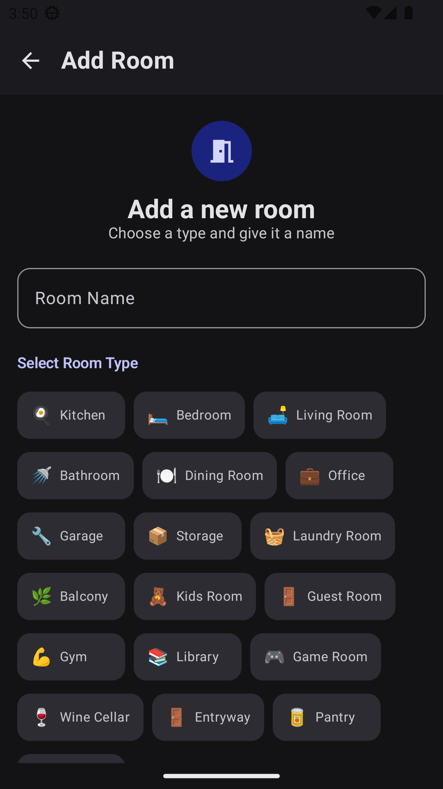

# Stuff Locate

A smart Android home storage organizer that helps you catalog, photograph, and locate everything in your home.

## Features

- **Multi-home management** — Organize items across multiple homes/properties
- **Room & floor tracking** — Hierarchical structure: Home → Floor → Room → Items
- **Photo inventory** — Capture multiple photos per item + location photos
- **2D floor plan editor** — Draw walls, rooms, and L-shapes with snap-to-grid
- **3D isometric preview** — Visualize your floor plan in 3D with rotation/zoom
- **Furniture placement** — Place furniture from a library of 10 types on your floor plan
- **Smart search** — Search items by name, category, room, or description
- **Glass morphism UI** — Beautiful glass-effect design with 10 built-in color themes
- **Custom themes** — Create, import, and export your own color themes
- **Dark mode** — Full dark mode support with theme-reactive components

## Screenshots

| Dashboard | Drawer | Search | Home Detail |
|-----------|--------|--------|-------------|
|  |  |  |  |

## Tech Stack

| Library | Purpose |
|---------|---------|
| **Kotlin 2.0.21** | Language |
| **Jetpack Compose** | Modern Android UI |
| **Material 3** | Design system |
| **Room 2.7.0** | Local database |
| **Navigation3** | Type-safe navigation |
| **CameraX** | Camera integration |
| **Coil** | Image loading |
| **Coroutines** | Asynchronous programming |

## Build

### Prerequisites

- Android Studio Ladybug (2024.2) or newer
- JDK 17+
- Android SDK 36

### Build the APK

```bash
git clone https://github.com/dev-redakai/StuffLocate.git
cd StuffLocate/app-project
./gradlew assembleDebug
```

The debug APK will be at `app/build/outputs/apk/debug/StuffLocate-debug.apk`.

### Install on device/emulator

```bash
adb install app/build/outputs/apk/debug/StuffLocate-debug.apk
```

## Project Structure

```
Stuff_locate/
├── app-project/              # Android project root
│   ├── app/src/main/java/com/stufflocate/app/
│   │   ├── data/             # Room database, DAOs, entities
│   │   ├── domain/           # Domain models, repository interface
│   │   ├── di/               # ServiceLocator (dependency injection)
│   │   ├── floorplan/        # 2D editor, 3D view, furniture placement
│   │   ├── theme/            # Glass morphism, AppThemeManager, presets
│   │   ├── ui/
│   │   │   ├── about/        # About screen
│   │   │   ├── home/         # Home detail, floor, room screens
│   │   │   ├── item/         # Item form, detail screens
│   │   │   ├── main/         # Dashboard, navigation drawer
│   │   │   ├── search/       # Search & filter
│   │   │   ├── settings/     # Settings screen
│   │   │   └── common/       # Shared UI components
│   │   └── Navigation.kt     # 24-screen Navigation3 graph
│   └── build.gradle.kts
├── CHECKPOINT.md
├── PRD.md
├── ROADMAP.md
├── SYSTEM_DESIGN.md
├── TASKS.md
├── UI_UX_SPEC.md
└── LICENSE
```

## Architecture

- **MVVM + Clean Architecture** — ViewModels, UseCases, Repository pattern
- **ServiceLocator** — Manual dependency injection (no Hilt/Dagger overhead)
- **Room** — SQLite with v2 migration support
- **Navigation3** — Type-safe Compose navigation with 24 destination screens

## License

```
Copyright 2026 Manikant Goutam

Licensed under the Apache License, Version 2.0 (the "License");
you may not use this file except in compliance with the License.
You may obtain a copy of the License at

    http://www.apache.org/licenses/LICENSE-2.0

Unless required by applicable law or agreed to in writing, software
distributed under the License is distributed on an "AS IS" BASIS,
WITHOUT WARRANTIES OR CONDITIONS OF ANY KIND, either express or implied.
See the License for the specific language governing permissions and
limitations under the License.
```
