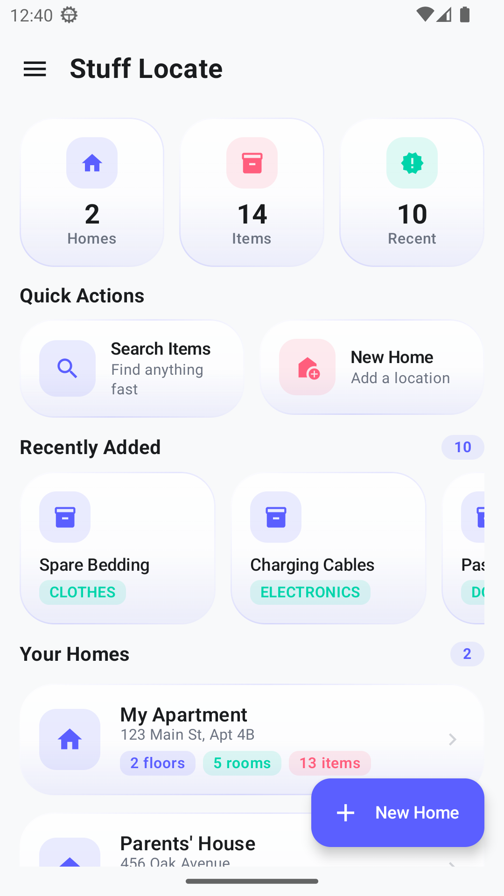
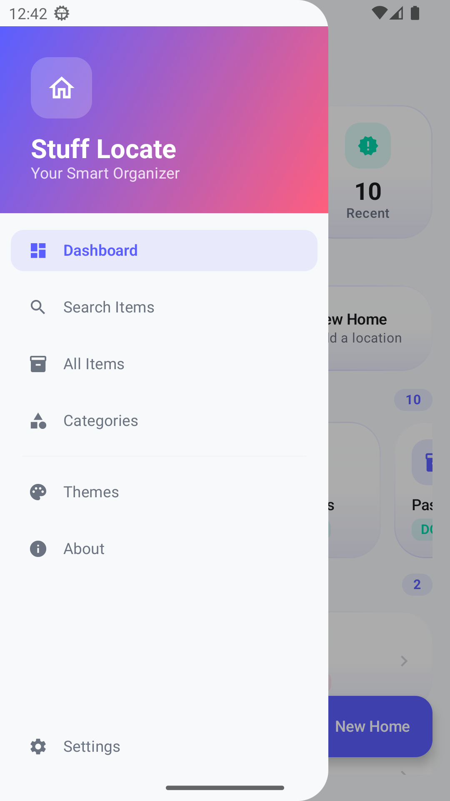
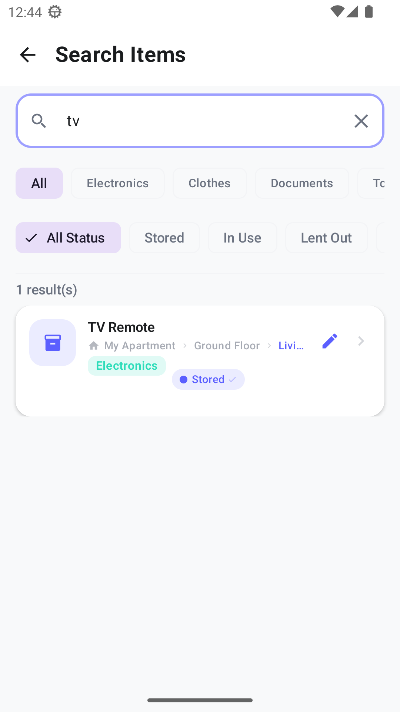
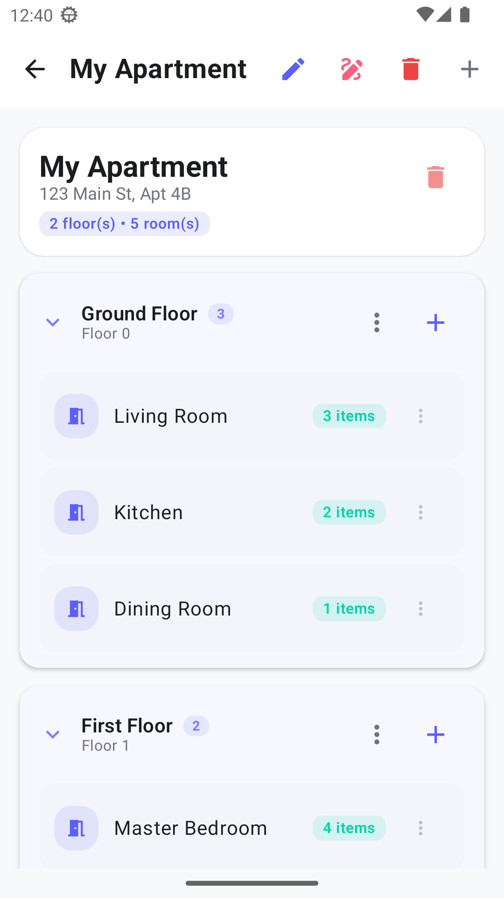
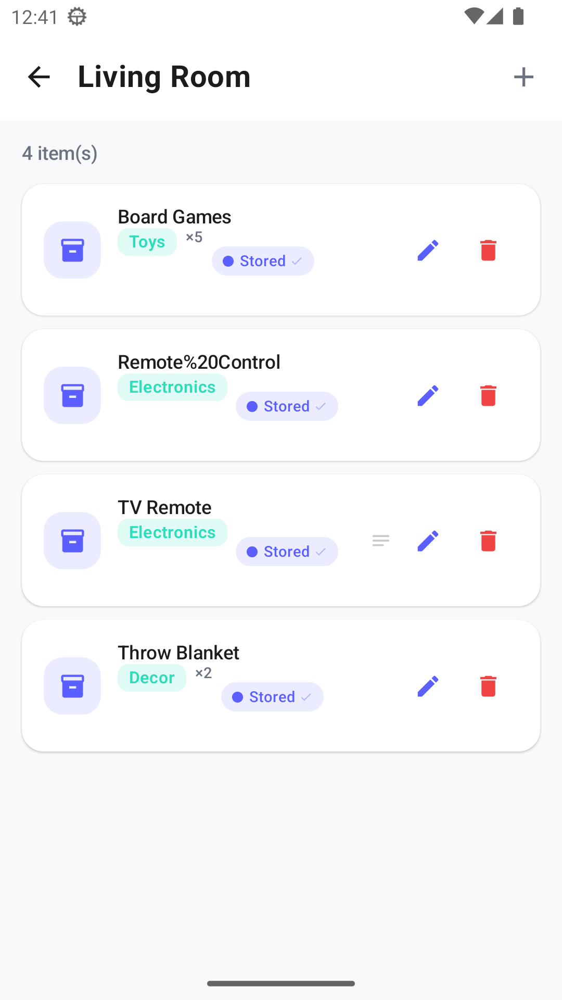

<h1 align="center">
  <br/>
  
  <br/>
  Stuff Locate
  <br/>
</h1>

<h4 align="center">Your Smart Home Storage Organizer</h4>

<p align="center">
  <em>Catalog, photograph, and instantly locate everything in your home.</em>
</p>

<p align="center">
  <a href="https://github.com/dev-redakai/StuffLocate/releases/latest">
    
  </a>
  <a href="https://github.com/dev-redakai/StuffLocate/blob/master/LICENSE">
    
  </a>
  
  
</p>

<p align="center">
  <a href="#features">Features</a> &bull;
  <a href="#screenshots">Screenshots</a> &bull;
  <a href="#download">Download</a> &bull;
  <a href="#build">Build</a> &bull;
  <a href="#architecture">Architecture</a> &bull;
  <a href="#license">License</a>
</p>

---

## Why Stuff Locate?

> Ever lost something at home and spent 30 minutes looking for it? Stuff Locate lets you **photograph** where each item lives, so you never search blindly again.

<details open>
<summary><strong>How it works</strong></summary>
<br/>

1. **Create a Home** &mdash; Give it a name and address
2. **Add Floors & Rooms** &mdash; Organize by floor, then room
3. **Add Items** &mdash; Name it, categorize it, snap a photo of where it lives
4. **Find Anything** &mdash; Search instantly across all your homes

</details>

---

## Features

<table>
  <tr>
    <td width="50%" valign="top">

### 🏠 Multi-Home Management
Organize items across multiple properties &mdash; your apartment, office, parents' house.

### 🏗️ Hierarchical Structure
Home &rarr; Floor &rarr; Room &rarr; Items. Clean, intuitive hierarchy.

### 📸 Photo Inventory
Capture multiple photos per item + location photos showing exactly where it lives.

### 🔍 Smart Search
Find items by name, category, room, or description across all homes.

    </td>
    <td width="50%" valign="top">

### 📐 2D Floor Plan Editor
Draw walls, rooms, and L-shapes with snap-to-grid precision.

### 🧊 3D Isometric Preview
Visualize your floor plan in 3D with rotation and zoom.

### 🛋️ Furniture Placement
Place furniture from a library of 10 types on your floor plan.

### 🎨 Glass Morphism UI
Beautiful glass-effect design with 10 built-in color themes.

    </td>
  </tr>
</table>

<details>
<summary><strong>More features</strong></summary>
<br/>

- **Custom Themes** &mdash; Create, import, and export your own color themes
- **Dark Mode** &mdash; Full dark mode support with theme-reactive components
- **Room Reassignment** &mdash; Move items between rooms with a single tap
- **Status Tracking** &mdash; Mark items as Stored, In Use, Lent Out, or Donated
- **Tag System** &mdash; Add custom tags for faster filtering

</details>

---

## Screenshots

<p align="center">
  
  &nbsp;&nbsp;
  
  &nbsp;&nbsp;
  
</p>
<p align="center">
  <em>Dashboard &nbsp;&bull;&nbsp; Navigation Drawer &nbsp;&bull;&nbsp; Smart Search</em>
</p>

<p align="center">
  
  &nbsp;&nbsp;
  
</p>
<p align="center">
  <em>Home Detail &nbsp;&bull;&nbsp; Room Items</em>
</p>

---

## Tech Stack

| | Library | Purpose |
|---|---------|---------|
| 🟣 | **Kotlin 2.0.21** | Language |
| 🎨 | **Jetpack Compose** | Modern Android UI toolkit |
| 💎 | **Material 3** | Design system |
| 🗄️ | **Room 2.7.0** | Local SQLite database |
| 🧭 | **Navigation3** | Type-safe Compose navigation |
| 📷 | **CameraX** | Camera integration |
| 🖼️ | **Coil** | Async image loading |
| ⚡ | **Coroutines + Flow** | Asynchronous & reactive programming |

---

## Download

<p align="center">
  <a href="https://github.com/dev-redakai/StuffLocate/releases/latest">
    
  </a>
</p>

Or build from source:

```bash
git clone https://github.com/dev-redakai/StuffLocate.git
cd StuffLocate/app-project
./gradlew assembleDebug
```

APK output: `app/build/outputs/apk/debug/StuffLocate-v1.0-debug.apk`

---

## Build

<details>
<summary><strong>Prerequisites</strong></summary>
<br/>

- Android Studio Ladybug (2024.2) or newer
- JDK 17+
- Android SDK 36

</details>

<details open>
<summary><strong>Quick start</strong></summary>
<br/>

```bash
# Clone
git clone https://github.com/dev-redakai/StuffLocate.git

# Build
cd StuffLocate/app-project
./gradlew assembleDebug

# Install
adb install app/build/outputs/apk/debug/StuffLocate-v1.0-debug.apk
```

</details>

---

## Project Structure

<details>
<summary><strong>Expand directory tree</strong></summary>
<br/>

```
StuffLocate/
├── app-project/                      # Android project root
│   ├── app/src/main/java/com/stufflocate/app/
│   │   ├── data/                     # Room database, DAOs, entities
│   │   ├── domain/                   # Domain models, repository interface
│   │   ├── di/                       # ServiceLocator (dependency injection)
│   │   ├── camera/                   # Photo capture & storage
│   │   ├── floorplan/                # 2D editor, 3D view, furniture placement
│   │   ├── theme/                    # Glass morphism, AppThemeManager, presets
│   │   ├── ui/
│   │   │   ├── about/                # About screen
│   │   │   ├── home/                 # Home detail, floor, room screens
│   │   │   ├── item/                 # Item form, detail screens
│   │   │   ├── main/                 # Dashboard, navigation drawer
│   │   │   ├── search/               # Search & filter
│   │   │   ├── settings/             # Settings screen
│   │   │   └── common/               # Shared UI components
│   │   └── Navigation.kt             # 24-screen Navigation3 graph
│   └── build.gradle.kts
├── screenshots/                      # App screenshots
└── LICENSE
```

</details>

---

## Architecture

<p align="center">
  
  
  
  
</p>

- **MVVM + Clean Architecture** &mdash; ViewModels, Repository pattern, reactive data flows
- **ServiceLocator** &mdash; Manual dependency injection (no Hilt/Dagger overhead)
- **Room** &mdash; SQLite with v3 migration support
- **Navigation3** &mdash; Type-safe Compose navigation with 24 destination screens

---

## License

```
Copyright 2026 Manikant Goutam

Licensed under the Apache License, Version 2.0 (the "License");
you may not use this file except in compliance with the License.
You may obtain a copy of the License at

    http://www.apache.org/licenses/LICENSE-2.0

Unless required by applicable law or agreed to in writing, software
distributed under the License is distributed on an "AS IS" BASIS,
WITHOUT WARRANTIES OR CONDITIONS OF ANY KIND, either express or implied.
See the License for the specific language governing permissions and
limitations under the License.
```

---

<p align="center">
  Made with ❤️ by <a href="https://github.com/dev-redakai">Manikant Goutam</a>
</p>
